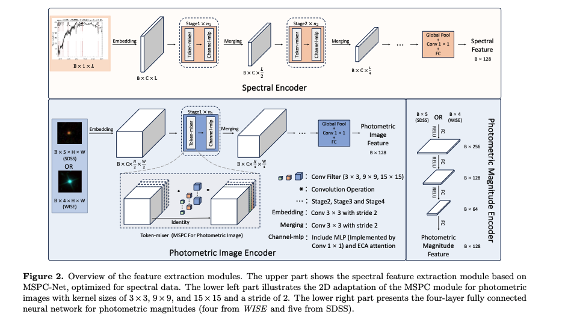
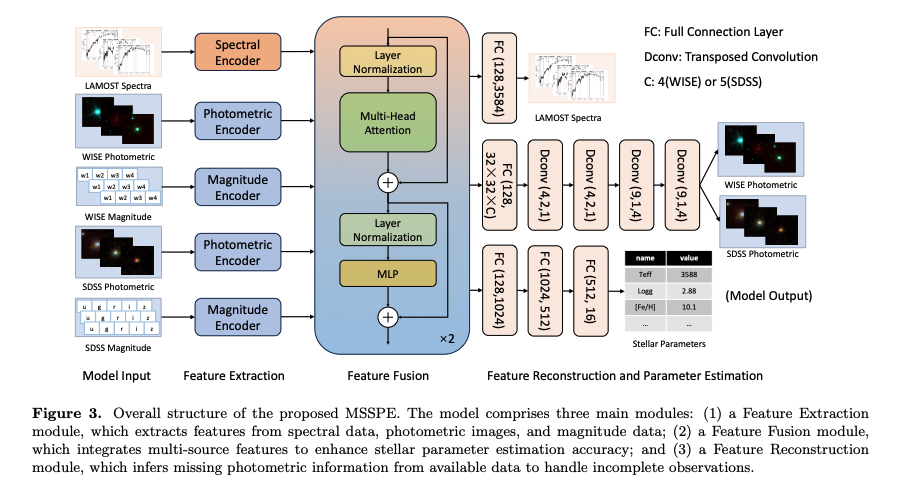

# MSSPE: Multi-Source Stellar Parameter Estimation under Incomplete Photometric Conditions




## Environment

> - Ubuntu Server 22.04 LTS
> - Python 3.10.8
> - CUDA 11.7
> - CUDNN 8.5

Create a new conda environment and install the required packages:

```shell
conda create -n msspe python=3.10
conda activate msspe
conda install pytorch torchvision torchaudio pytorch-cuda=11.7 -c pytorch -c nvidia
pip3 install opencv-python matplotlib scipy scikit-learn tqdm tensorboard tensorboardX torchinfo
```

Before training, check the `cfg/cfg.py` file to set your training configuration.


