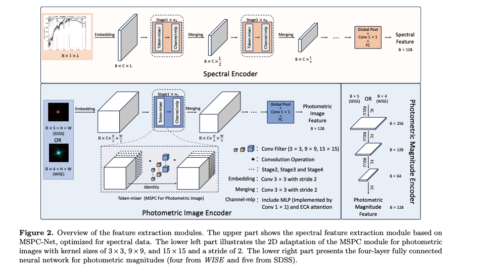
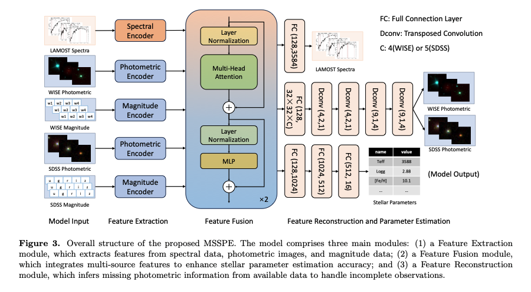

# MSSPE: Multi-Source Stellar Parameter Estimation under Incomplete Photometric Conditions





## Requirements

1. Clone this repo in your directory and enter the repo directory.

   ```bash
   git clone https://github.com/qintianjian-lab/MSSPE.git
   cd ./MSSPE
   ```

2. Create `conda` environment (`python >= 3.10`) and activate the environment.

   ```bash
   conda create -n msspe python=3.11
   conda activate msspe
   ```

3. Install all requirement.

   ```bash
   pip install -r requirements.txt
   ```

4. Training model with `./cfg/cfg.py`.

   ```bash
   python train.py
   ```

Before training, check the `cfg/cfg.py` file to set your training configuration.


